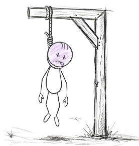

# Tito el Monito Ahorcado 🐒

**Ahorcado interactivo reinventado con identidad visual de boceto, economía de Lápices, power-ups, logros y ranking.**

Versión **1.0.0-beta** — Java 21 · Swing · FlatLaf · SQLite

> El clásico juego del ahorcado, llevado a una experiencia de escritorio completa:
> dificultades progresivas, reloj, monedas, útiles escolares con poderes especiales,
> 30 logros + medallas por categoría, y persistencia local para cada jugador.

---

## 🖼️ Capturas

| Menú principal | Juego | Logros |
|---|---|---|
|  |  |  |

| Estadísticas | Acerca de | Fin de partida |
|---|---|---|
|  |  |  |

---

## ✨ Características

### Jugabilidad
- **5 niveles de dificultad** (Fácil → Imposible) con tiempos base y multiplicadores de premio propios.
- **Reloj por turno** que aumenta la tensión y alimenta logros como *Contra el Reloj*.
- Palabras seleccionadas automáticamente de 40+ categorías, sin repetir las ya descubiertas.

### Economía de Lápices ✏️
- Monedas por letra acertada, premio base por dificultad, bono de victoria y bono por vidas restantes.
- **Premio asegurado** proporcional al progreso: siempre ganas algo por intentar.

### Power-ups (útiles escolares)
| Útil | Precio | Efecto |
|---|---|---|
| 🪛 Sacapuntas | $20 | +10s al reloj |
| ✂️ Tijeras | $35 | +1 vida (una vez por partida) |
| 🧽 Goma | $30 | Desactiva 4 letras incorrectas |
| 🖊️ Pluma | $50 | Revela la letra restante más frecuente |
| 🖍️ Marcatextos | $65 | Muestra una pista (desactivado en Imposible) |

### Logros y medallas 🏅
- **Medallas** por las 16 categorías × 4 niveles (bloqueado, bronce, plata, oro).
- **30 hazañas** (12 históricas + 18 en tiempo real) con premios de $20 a $3,000.
- Evaluación automática: históricos al abrir la pestaña de Logros, y en tiempo real al liquidar cada partida.

### Perfil y persistencia
- Sistema de **login / creación de jugador** con bono de bienvenida de $50.
- **Estadísticas, ranking y progreso por categoría** guardados en SQLite local.
- Datos en `~/Documents/Tito el Monito Ahorcado/tito_db.db`.

---

## 🚀 Instalación y ejecución

### Opción A — Instalador EXE (recomendado para usuarios)
1. Descarga `Tito-El-Monito-Ahorcado-1.0.0-beta-setup.exe`.
2. Ejecútalo y sigue el asistente (instala en `C:\Program Files\Tito el Monito Ahorcado`).
3. Inicia desde el acceso directo del menú **Inicio** o el escritorio.
4. **No requiere Java instalado**: el instalador incluye su propio runtime.

### Opción B — Portable (sin instalación)
1. Descarga `Tito-El-Monito-Ahorcado-1.0.0-beta-portable.zip`.
2. Descomprime y ejecuta `Tito el Monito Ahorcado.exe` desde la carpeta.

### Opción C — Fat JAR (requiere Java 21)
```
java -jar Tito_El_Monito_Ahorcado-1.0.0-beta.jar
```

> Los datos de cada jugador se guardan en `Documentos/Tito el Monito Ahorcado/`, nunca se borran al desinstalar.

---

## 🛠️ Requisitos del sistema

- **Windows 10/11** (64 bits) para instalador y portable.
- **Java 21** únicamente para ejecutar el JAR o compilar desde fuente.
- ~100 MB de espacio en disco (runtime incluido).

---

## ⚙️ Compilar desde el código fuente

```bash
# 1. Fat JAR ejecutable (incluye todas las dependencias)
mvn clean package

# 2. Distribución completa (app-image + ZIP portable + instalador EXE)
#    Requiere: JDK 21 (con jpackage) + WiX Toolset 3.14 en PATH
powershell -File tools/build-installer.ps1
```

Los artefactos quedan en `target/dist/`:
- `Tito-El-Monito-Ahorcado-1.0.0-beta-setup.exe` — instalador personalizado
- `Tito-El-Monito-Ahorcado-1.0.0-beta-portable.zip` — versión portable
- `Tito_El_Monito_Ahorcado-1.0.0-beta.jar` — fat jar

> El script también genera `icono.ico` automáticamente desde `icono.png` (via `tools/PngToIco.java`),
> de modo que el instalador y el ejecutable llevan el icono del monito.

---

## 📂 Estructura del proyecto

```
src/main/java/com/titomonito/
├── Main.java                 # Punto de entrada
├── config/                   # ConfigDB (SQLite + migraciones), GlobalConfig (logs)
├── dao/                      # GeneralDAO, JuegoDAO, JugadorDAO, LogrosDAO
├── models/                   # Categorias, Jugador, Palabra, SnapshotPartida
├── services/                 # LogicaJuego, LogrosService, SesionJuegoTracker,
│                             # SesionManager, ServicioSonido, UtilsJuego
├── enums/                    # Constantes, LogroId, Dificultad, etc.
└── ui/                       # VentanaLogin, VentanaBase, PanelMenu, vistas/
```

## 🧰 Tecnologías

| Capa | Tecnología |
|---|---|
| Lenguaje / Runtime | Java 21 |
| GUI | Java Swing + FlatLaf (tema `FlatMTGitHubIJTheme`) |
| Base de datos | SQLite (xerial sqlite-jdbc) |
| Build | Maven + maven-shade-plugin |
| Empaquetado | jpackage + jlink (JRE recortado) + WiX Toolset |

---

## 📄 Licencia

Distribuido bajo [GNU General Public License v3.0](LICENSE).

---

Hecho con ❤ por **Adán Cortés** · [@adancortes-ing](https://github.com/adancortes-ing)